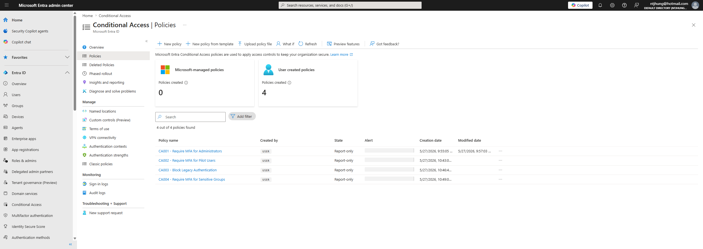
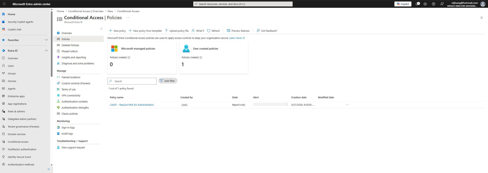
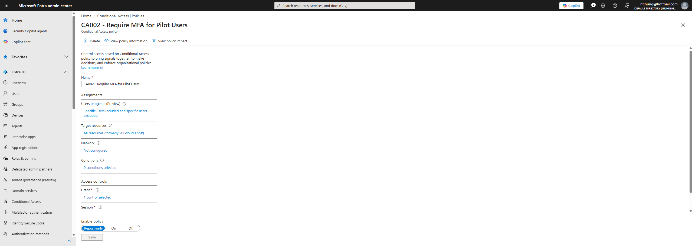
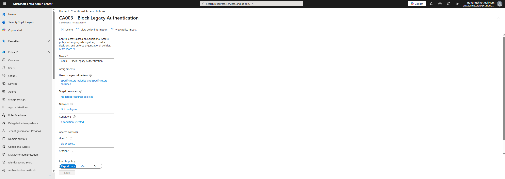
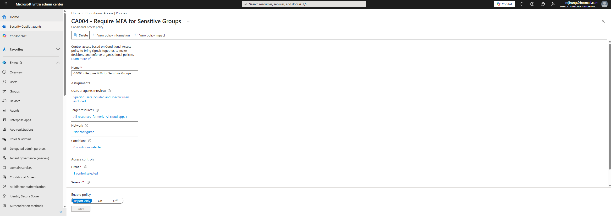

## Policies Created

- CA001 - Require MFA for Administrators
- CA002 - Require MFA for Pilot Users
- CA003 - Block Legacy Authentication
- CA004 - Require MFA for Sensitive Groups

## Lab Screenshots

### Conditional Access Policy List

### Admin MFA Policy

### Pilot Users MFA Policy

### Block Legacy Authentication Policy

### Sensitive Groups MFA Policy

## Resume Bullet

- Designed and configured Microsoft Entra Conditional Access policies in report-only mode, including administrator MFA, pilot user MFA, legacy authentication blocking, sensitive group protection, break-glass account exclusions, testing strategy, and rollback documentation.
