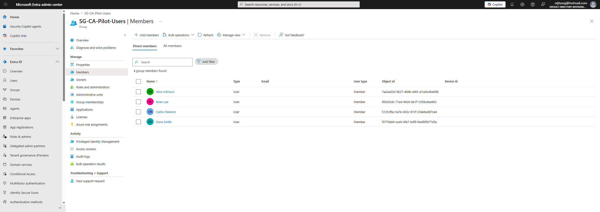
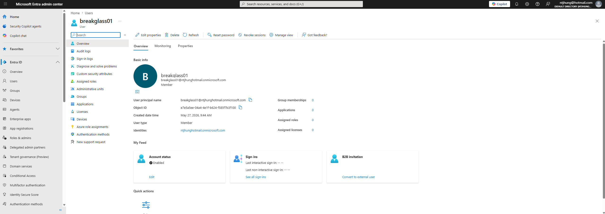
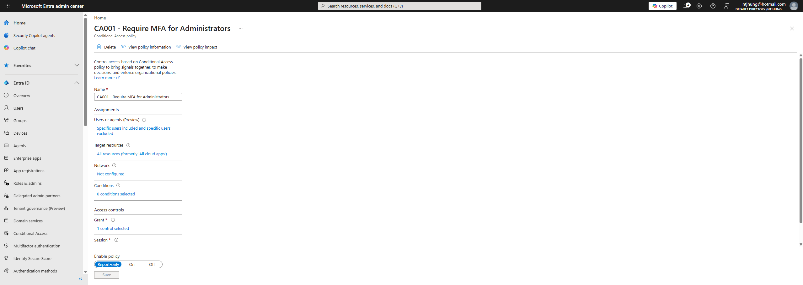

# Entra Conditional Access Security Baseline

## Project Overview

This project demonstrates a Microsoft Entra ID Conditional Access security baseline. The lab focuses on creating and documenting Conditional Access policies in report-only mode to improve identity security while reducing the risk of accidentally blocking users or administrators.

The project originally started as a Conditional Access design and rollout plan because the lab tenant did not have the required licensing. After Microsoft Entra ID P2 trial access was activated, the project was upgraded to include live Conditional Access policy configuration screenshots.

## Business Problem

Organizations need to protect user identities without causing unnecessary business disruption. Conditional Access policies help enforce security controls such as MFA, admin protection, legacy authentication blocking, and sensitive group protection. These policies should be planned, tested, documented, and rolled out carefully.

## Tools Used

- Microsoft Entra ID
- Microsoft Entra ID P2 Trial
- Conditional Access
- MFA policy planning
- Security groups
- Break-glass account planning
- Report-only mode
- Rollback planning
- GitHub documentation
- Screenshots as audit evidence

## What This Project Demonstrates

- Conditional Access policy planning
- Live Conditional Access policy creation
- Report-only policy deployment
- MFA enforcement strategy
- Admin account protection
- Sensitive group protection
- Legacy authentication blocking strategy
- Break-glass account exclusions
- Rollback documentation
- IAM security documentation
- Evidence collection

## Policies Created

### CA001 - Require MFA for Administrators

This policy targets privileged administrator roles and requires MFA. It was configured in report-only mode to safely test impact before enforcement.

### CA002 - Require MFA for Pilot Users

This policy targets a Conditional Access pilot group and requires MFA for selected users. The pilot group allows controlled testing before applying policies more broadly.

### CA003 - Block Legacy Authentication

This policy is designed to block older authentication methods that do not support modern security controls. It was created in report-only mode to review potential impact before enforcement.

### CA004 - Require MFA for Sensitive Groups

This policy targets sensitive groups such as HR, Finance, IT Admins, and Contractors. These groups may have elevated risk because they involve sensitive business data, privileged access, or temporary contractor access.

## Lab Groups and Accounts

### Conditional Access Pilot Group

- SG-CA-Pilot-Users

Example pilot users:

- Alice Johnson
- Brian Lee
- Carlos Ramirez
- Dana Smith

### Sensitive Groups

- SG-HR-Employees
- SG-Finance-Employees
- SG-IT-Admins
- SG-Contractors

### Break-Glass Account

A break-glass account was documented for emergency access planning. Break-glass accounts should not be used for daily administration and should be excluded from selected Conditional Access policies to reduce the risk of full tenant lockout.

## Project Files

- docs/
- screenshots/

## Documentation Created

- docs/Conditional-Access-Policy-Matrix.md
- docs/Break-Glass-Account-Plan.md
- docs/Rollback-Plan.md
- docs/Testing-Results.md

## Lab Screenshots

### Conditional Access Policy List

### Conditional Access Pilot Group Members

### Break-Glass Account

### CA001 - Require MFA for Administrators

### CA001 - Report-Only Mode

### CA002 - Require MFA for Pilot Users

### CA003 - Block Legacy Authentication

### CA004 - Require MFA for Sensitive Groups

## Key IAM Concepts Demonstrated

### Conditional Access

Conditional Access helps control access based on users, groups, applications, client apps, risk, device state, location, and other conditions.

### MFA

Multi-factor authentication adds an additional layer of protection beyond username and password authentication.

### Report-Only Mode

Report-only mode allows Conditional Access policies to be tested before enforcement. This helps reduce the chance of accidentally blocking users, administrators, or business-critical access.

### Break-Glass Accounts

Break-glass accounts are emergency administrator accounts used if normal administrator access is unavailable. They should be documented, protected, monitored, and excluded carefully from selected policies.

### Legacy Authentication Blocking

Legacy authentication methods can create security risk because they may not support modern protections such as MFA. Blocking legacy authentication helps reduce account compromise risk.

### Sensitive Group Protection

Sensitive groups such as Finance, HR, IT Admins, and Contractors should have stronger access controls because they may involve confidential data, privileged permissions, or temporary access.

### Rollback Planning

Rollback documentation explains how to quickly disable or change a Conditional Access policy if it causes unexpected access issues.

## Testing Approach

The Conditional Access policies were configured in report-only mode first. This allows the policies to be reviewed and tested before being enforced.

The testing approach includes:

1. Create a pilot group.
2. Add selected test users.
3. Create Conditional Access policies in report-only mode.
4. Exclude break-glass accounts where appropriate.
5. Review policy configuration.
6. Collect screenshots as evidence.
7. Document rollback steps.
8. Move toward enforcement only after testing is complete.

## Resume Bullet

- Designed and configured Microsoft Entra Conditional Access policies in report-only mode, including administrator MFA, pilot user MFA, legacy authentication blocking, sensitive group protection, break-glass account exclusions, testing strategy, rollback planning, and audit evidence documentation.

## Status

Completed Conditional Access security baseline lab with live report-only policies, pilot group targeting, break-glass planning, rollback documentation, policy matrix, testing notes, and screenshots.
